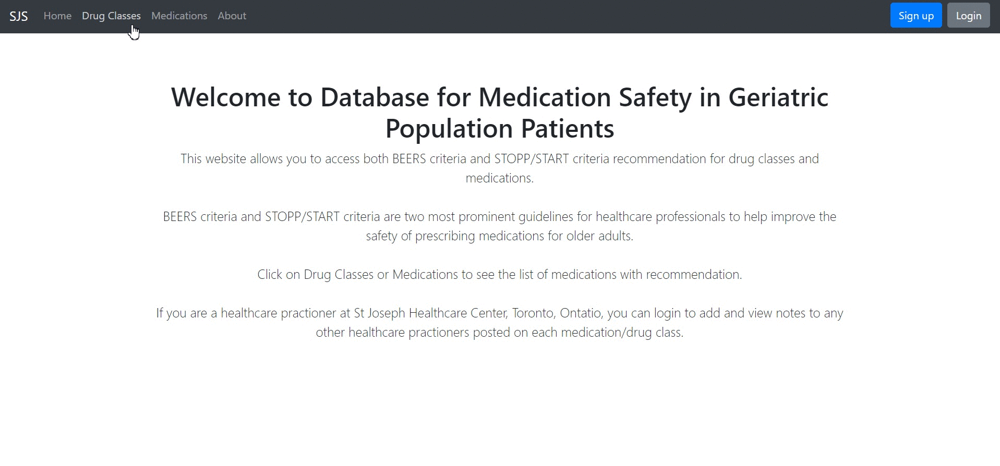
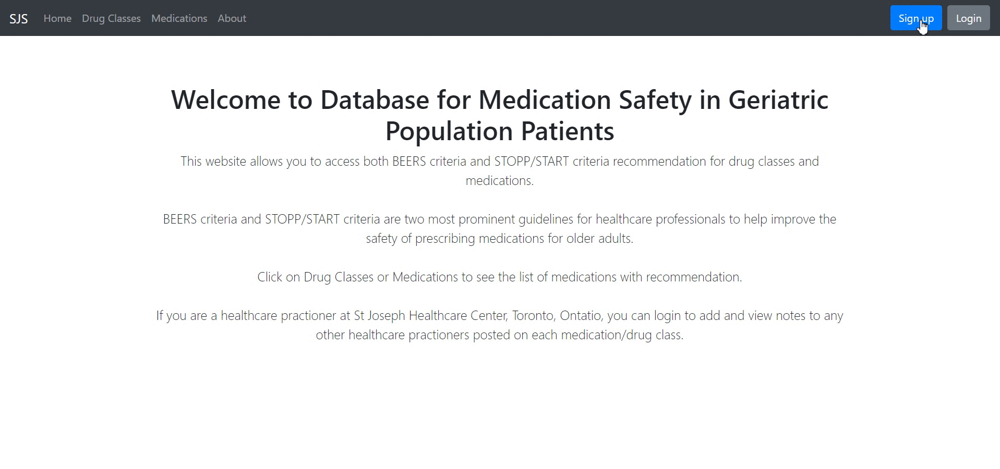

# Database for Medication Safety in Geriatric (DMSG)

DMSG is web application that allows users to access safety information of medications for older adults from both BEERS criteria and STOPP/START Toolkit. It is intended to be use within a healthcare institution where healthcare professionals can sign-in to the application and share notes with each other regarding any medication, drug class and recommendation in the database. This repository provides the framework of the application (along with the database).

## Demo 

<b>Click [here](https://database-for-medication-safety.herokuapp.com/) to view the web application in the browser.</b> 
Please note this particular website is only used as a demo and it is not the intended platform for healthcare professionals to share notes in. If you want to use the application for your own healthcare institution, please read Getting Started.

In this GIF, you will see a user accessing the guideline in database, posting a note under one of the medication and viewing other notes that were posted.


In this GIF, you will see the complete sign-up procedure for this application.


## Usage

1. To view guidelines from BEERS and STOPP/START, simply click on any medication/drug classes under "Medications" or "Drug Classes" in navigation bar.
2. To view and post notes, you have to register and sign-in to an account. 
3. Click on "Submit Note" or "View Note" button under each medication/drug class to submit or read note.
4. Each user is only allowed to post 1 note per medication/drug class, posting another note will override old note.

## Getting Started
This repository simply provides the framework of the web application and some code will need to be changed to accommodate each healthcare institution. 

### Clone this project

```bash
  git clone https://github.com/calvinhychu/Database-for-Medication-Safety-in-Geriatric.git
```

### Code that needs modification
1. Change config.cfg for secret key, postgreSQL location, email server, email account and other relevant email information
2. Change check_email_domain under forms.py to restrain email accounts from one certain domain to be able to register for an account (optional)

### To run it locally 
1. Install python modules under requirements.txt
2. Run create_table() in commands.py to create tables and insert guidelines to database
3. Run main.py

## How it works?
DBSG uses Flask for it's web framework and SQLAlchemy to manage an PostgreSQL database.

Other python modules like flask_login, flask-wtf and itsdangerous are also used to develop account registration system

## Guidelines
BEERS criteria and STOPP/START criteria are two most prominent guidelines for healthcare professionals to help improve the safety of prescribing medications for older adults. BEERS criteria is a guideline published by American Geriatric Society in 2015 to identify potentially inappropriate medication use in geriatric population. You can click [here](https://www.guidelinecentral.com/summaries/american-geriatrics-society-2015-updated-beers-criteria-for-potentially-inappropriate-medication-use-in-older-adults/#section-society
to view the full publication of BEERS criteria. STOPP (Screening Tool of Older Persons’ Prescriptions) and START (Screening Tool to Alert to Right Treatment) are explicit criteria that facilitate medication review in multi-morbid older people in most clinical settings. You can click [here](https://www.tandfonline.com/doi/abs/10.1080/17512433.2020.1697676?journalCode=ierj20) to view full publication of STOPP/START.

## Disclaimer
DMSG is designed and created by Calvin Chu in Aug, 2020. It is developed in cooperation with Anticoagulation clinic and Geriatric clinic at St Joseph Healthcare Center, Toronto, Ontario. However, it is not affiliated with St Joseph Healthcare Center, BEERS criteria and STOPP/START criteria. This website only intended to be used for non-profit purpose. All guidelines are properties of BEERS criteria or STOPP/START criteria.